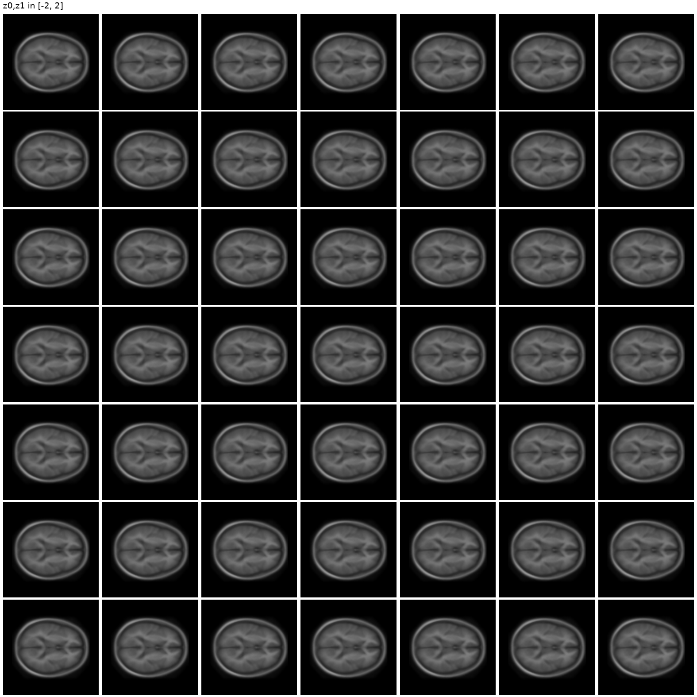
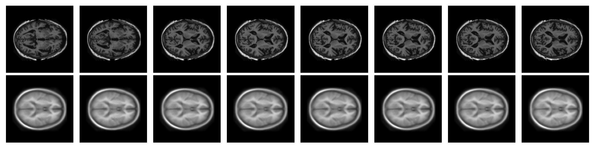
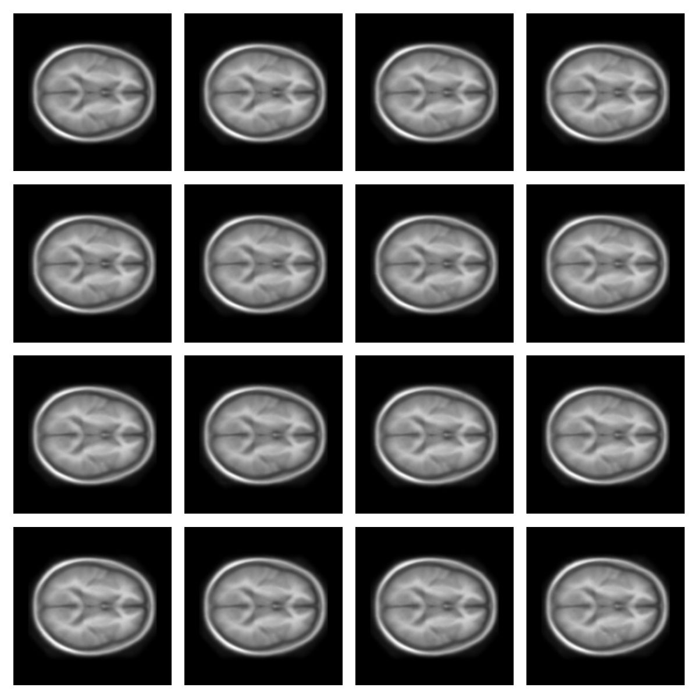
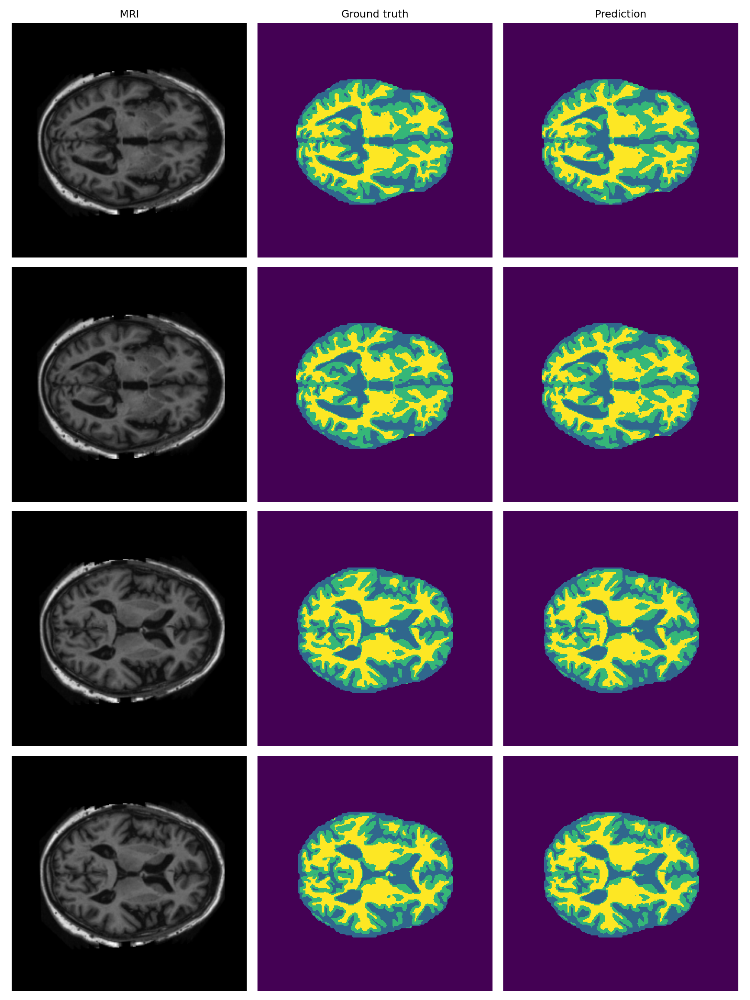
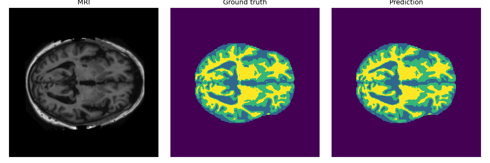

# COMP3710 Demo 2 - Part 4

This project implements the **Medium** version of Part 4: a convolutional
Variational Autoencoder (VAE) and a hand-written U-Net for the preprocessed
OASIS brain MRI dataset. No pretrained network or pre-built U-Net is used.

## Dataset

On Rangpur, the default dataset root is:

`/home/groups/comp3710/OASIS`

It contains `keras_png_slices_{train,validate,test}` and matching
`keras_png_slices_seg_{train,validate,test}` directories. MRI files named
`case_XXX_slice_Y.nii.png` are paired with `seg_XXX_slice_Y.nii.png`.
The segmentation label values are discovered from training masks at runtime,
then the same mapping is used for validation and test. If a class has no
target pixels and no predicted pixels across an evaluated split, its Dice is
reported as `NaN` (unavailable), rather than incorrectly reported as 1.0.

## Structure

- `common/oasis.py`: paired datasets and label discovery.
- `vae/`: VAE model, training, evaluation, and reconstruction/sample figures.
- `unet/`: manual U-Net, Dice metrics, training, evaluation, and inference.

## Requirements

Python 3.10+ with PyTorch, Pillow, NumPy, and Matplotlib. Run commands from
the `part4` directory. A CUDA GPU is used automatically when available, but
the scripts also support CPU smoke tests.

## VAE commands

```bash
python -m vae.train --epochs 50 --batch-size 16
python -m vae.evaluate --checkpoint checkpoints/vae_best.pth
```

Useful overrides include `--data-root`, `--learning-rate`, `--checkpoint`,
and `--output-dir`. Training writes a checkpoint and figures under the
ignored `checkpoints/` and `outputs/` directories. The VAE encodes an image
to `mu` and `logvar`, samples with the reparameterization trick, and decodes
the latent vector. Its objective combines pixel reconstruction error and KL
divergence. Random latent samples show generation from the prior. In addition,
`vae_latent_manifold.png` is a real 2D traversal: it decodes a 7x7 grid while
varying latent dimensions 0 and 1 from approximately -2 to 2 and keeping all
other dimensions at zero. UMAP is not required.

## U-Net commands

```bash
python -m unet.train --epochs 50 --batch-size 8
python -m unet.evaluate --checkpoint checkpoints/unet_best.pth
python -m unet.inference --checkpoint checkpoints/unet_best.pth
```

For a specific test MRI, add `--image /path/to/case_XXX_slice_Y.nii.png` to
the inference command. The U-Net has four encoder blocks, pooling, a
bottleneck, four decoder blocks with skip connections, and a 1x1 output
convolution. It returns logits shaped `[batch, classes, height, width]`.
Training combines Cross Entropy with multiclass Dice loss and selects the
best checkpoint primarily using minimum per-class validation Dice, with mean
Dice as a tie-breaker. This matches the assignment requirement that every
label should perform well. Evaluation prints Dice for every discovered class,
the mean over available classes, and the minimum over available classes. Dice is
`2 * intersection / (predicted pixels + target pixels)`.

## Outputs and results

VAE outputs include original/reconstructed MRI figures, random latent sample
images, and the 2D latent manifold. U-Net evaluation saves four examples,
each showing MRI, ground-truth mask, and predicted mask. Actual loss and Dice
results must be recorded after training on
Rangpur; this repository does not invent or guarantee a DSC above 0.9.

Generated checkpoints, figures, caches, and Python bytecode are ignored by
`.gitignore`.

## Final Results

### Task 1: Variational Autoencoder

The VAE was trained for 50 epochs on the preprocessed OASIS MRI dataset.

- Test VAE loss: **0.009350**
- Best model checkpoint is retained locally and is not committed to GitHub.
- The trained latent space was visualised using a 2D latent manifold.
- Reconstruction and latent-space samples were also generated.

#### Latent manifold



#### Reconstructions



#### Latent samples



### Task 2: UNet Segmentation

The custom UNet was trained on the preprocessed OASIS MRI segmentation dataset with four segmentation labels: `0`, `85`, `170`, and `255`.

Test-set Dice scores:

- Class 0: **0.999216**
- Class 1: **0.964321**
- Class 2: **0.962395**
- Class 3: **0.976379**
- Mean Dice: **0.975578**
- Minimum Dice: **0.962395**

All segmentation classes achieved a Dice score above **0.9**.

#### Test segmentation examples



#### Single-image inference



The trained `.pth` checkpoints are excluded from GitHub through `.gitignore` and retained separately for demonstration and inference.
